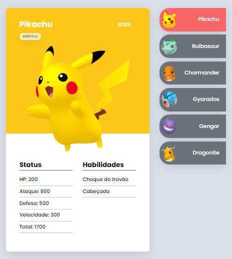
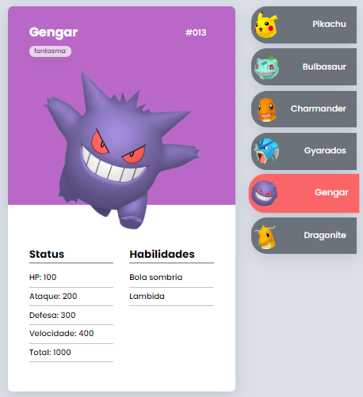

# Pokedéx 

> Uma pokedéx responsiva realizada com HTML, CSS e JavaScript, contendo informações dos Pokemons e marcando os pokemóns selecionados.

O site publicado pode ser acessado [aqui](https://marcellemarichal.github.io/projeto-pokedex/)

### Ajustes e melhorias

A próxima atualização será voltada à seguinte tarefa:

- [ ] Acrescentar mais Pokémons
